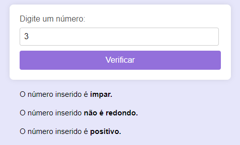

# cria-codigo

# Descrição do repositório
Atraves de um codigo antigo fui adptando  inserindo novas linhas de código. Sendo assim este repositório é um formulário que tem um campo para prencher que no caso são números, o bloco de php no código faz verificações como se o valor inserido pelo usuário é número par ou ímpar, redondo ou não, e se é positivo, negativo ou neutro. Além de verificar ele exibe uma mensagem da verificação.

## Funcionalidades
### Verifica se o número é:
- Par ou ímpar.
- Redondo ou não.
- Positivo, negativo ou neutro.

## Exemplo de Uso
1- O usuário digita um número no campo de preenchimento.  
2- O formulário vai exibir as informações do número como o exemplo o abaixo.  

## Fontes de Consulta

- Pesquisei algumas coisas para estilizar, como a tag que centraliza. Usei o site1. Para o botão mais arredondado, utilizei o [DevMedia](https://www.devmedia.com.br/css-como-criar-elementos-arredondados/37905) e pesquisei fontes para ver qual combinava com a página, utilizando o [DaFont](https://www.dafont.com/pt/).
- Utilizei um código antigo [código usado](atd2/par.php) que tinha como base a primeira condição de verificação se o valor era (par ou ímpar) e assim fui construindo as demais.
- Utilizei o [ChatGPT](https://chat.openai.com/) para pesquisar sobre números redondos, para conseguir criar as condições.
- Tambem utilizei o [Alura](https://www.alura.com.br/artigos/escrever-bom-readme) para estruturar o README.
